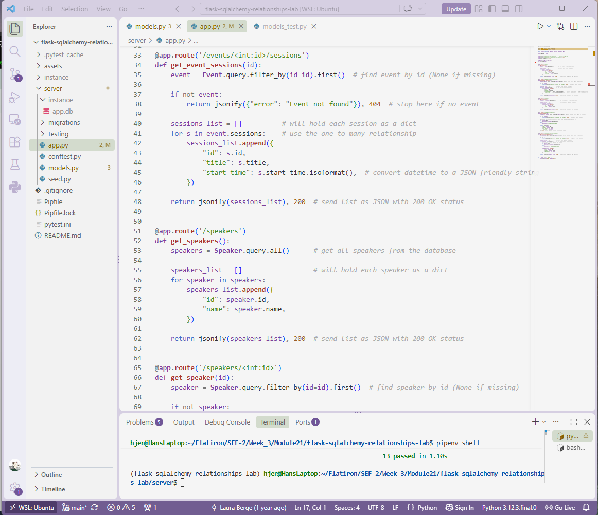

# EventWise API: Flask-SQLAlchemy Relationships Lab
**Completed Sept 23, 2026**

A Flask backend for EventWise, an event management company. The API models events, their sessions, speakers, and speaker bios, and serves the related data as JSON through a set of GET endpoints.

This project demonstrates the three main types of database relationships in Flask-SQLAlchemy:

- **One-to-many:** an Event has many Sessions
- **One-to-one:** a Speaker has one Bio
- **Many-to-many:** Sessions and Speakers are linked through the `session_speakers` association table



## Built With

- Python 3.8
- Flask
- Flask-SQLAlchemy
- Flask-Migrate
- SQLite
- pytest

## Data Models

| Model   | Attributes                               | Relationships                                        |
| ------- | ---------------------------------------- | ---------------------------------------------------- |
| Event   | id, name, location                       | `sessions` (one-to-many)                             |
| Session | id, title, start_time, event_id          | `event` (belongs to Event), `speakers` (many-to-many) |
| Speaker | id, name                                 | `bio` (one-to-one), `sessions` (many-to-many)        |
| Bio     | id, bio_text, speaker_id                 | `speaker` (belongs to Speaker)                       |

`session_speakers` is an association table with `session_id` and `speaker_id` foreign keys, which together form its primary key.

### Cascading Deletes

- Deleting an Event also deletes its Sessions.
- Deleting a Speaker also deletes their Bio.

## Installation

1. Clone the repository:

   ```
   git clone https://github.com/hanjennings1/flask-sqlalchemy-relationships-lab.git
   cd flask-sqlalchemy-relationships-lab
   ```

2. Install dependencies and enter the virtual environment:

   ```
   pipenv install
   pipenv shell
   ```

3. Move into the server folder and set the environment variables:

   ```
   cd server
   export FLASK_APP=app.py
   export FLASK_RUN_PORT=5555
   ```

4. Create the database tables from the existing migrations:

   ```
   flask db upgrade head
   ```

5. Seed the database with sample events, sessions, speakers, and bios:

   ```
   python seed.py
   ```

## Usage

Start the server from the `server/` folder:

```
flask run
```

The API runs at `http://localhost:5555`.

## API Endpoints

All responses are JSON.

| Method | Endpoint                    | Description                                              | Errors                                    |
| ------ | --------------------------- | -------------------------------------------------------- | ----------------------------------------- |
| GET    | `/events`                   | All events, with `id`, `name`, and `location`            | None                                      |
| GET    | `/events/<id>/sessions`     | All sessions for an event, with `id`, `title`, and `start_time` | `404` `{"error": "Event not found"}`      |
| GET    | `/speakers`                 | All speakers, with `id` and `name`                       | None                                      |
| GET    | `/speakers/<id>`            | One speaker, with `id`, `name`, and `bio_text`           | `404` `{"error": "Speaker not found"}`    |
| GET    | `/sessions/<id>/speakers`   | All speakers for a session, with `id`, `name`, and `bio_text` | `404` `{"error": "Session not found"}`    |

If a speaker has no bio, `bio_text` is returned as `"No bio available"`.

### Example Response

`GET /events/1/sessions`

```json
[
  {
    "id": 1,
    "start_time": "2023-09-15T10:00:00",
    "title": "Building Scalable Web Apps"
  },
  {
    "id": 2,
    "start_time": "2023-09-15T14:00:00",
    "title": "Intro to Machine Learning"
  }
]
```

## Testing

Run the full test suite from the `server/` folder:

```
pytest
```

All 13 tests pass across four test files:

- `models_test.py`: models, relationships, and cascades
- `event_endpoints_test.py`: event endpoints
- `speaker_endpoints_test.py`: speaker endpoints
- `session_endpoints_test.py`: session endpoints
